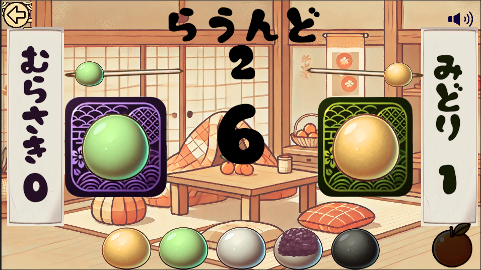

# Mochimochi Janken

A rock-paper-scissors game with mochi (rice cake) characters featuring randomly generated matchup tables, developed in Unity 2022.3.42f1.

**Language: Japanese**

## Overview
Mochimochi Janken is a unique take on the traditional rock-paper-scissors game, using mochi as characters and introducing a randomly generated matchup table for each game. This creates a fresh strategic experience each time you play.

## Technical Implementation
- Developed with Unity 2022.3.42f1 and C#

## Resources Used
- Font: KF Himaji Fude (KFひま字ふで) - https://www.kfstudio.net
- Background Music: BGMer - http://bgmer.net

## License
MIT License - See the [LICENSE](LICENSE) file for details.
